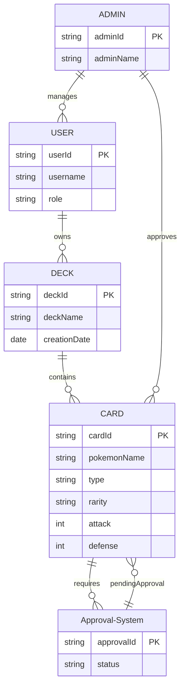
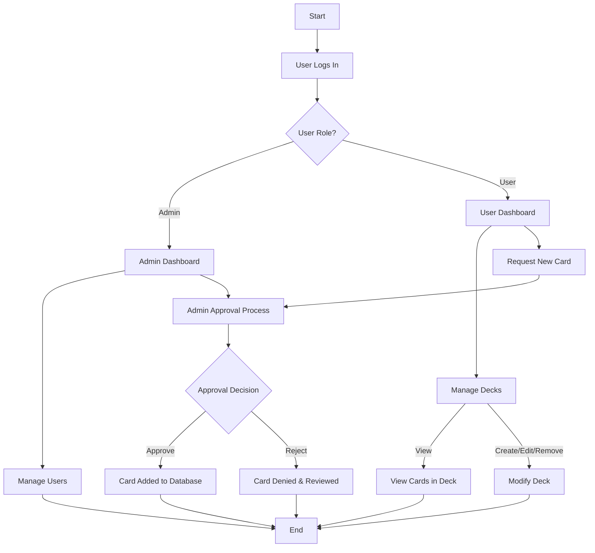
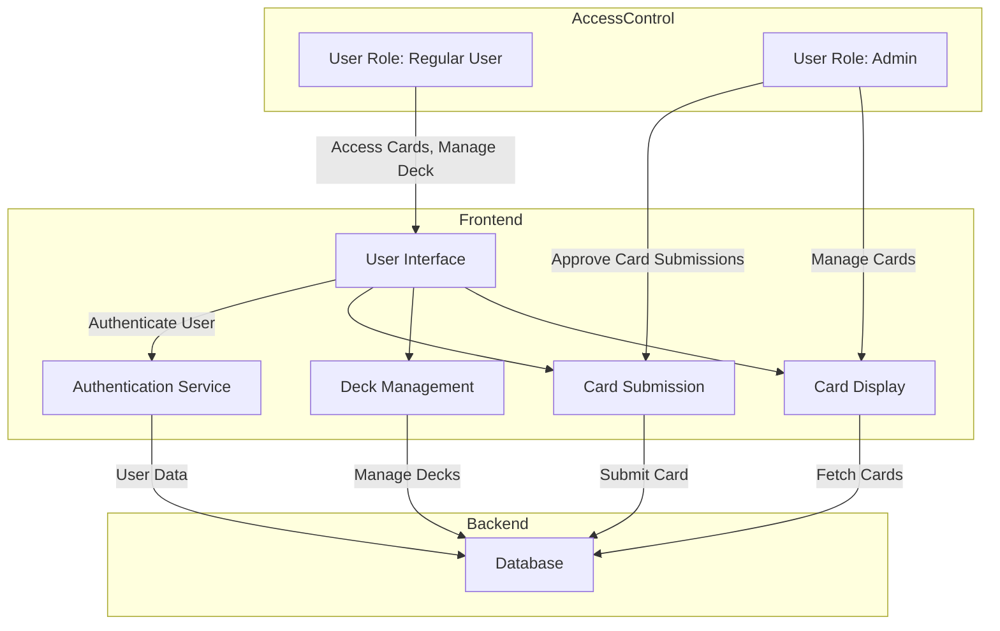

# 
Diagrams

## Entity Relationship Diagram

---

## User Flow Diagram

---

## System Architecture Diagram

## API Endpoints Table

| **Endpoint**                 | **HTTP Method** | **Description**                     | **Authentication/Authorization** |
|-----------------------------|-----------------|-------------------------------------|----------------------------------|
| `/api/cards`                | `GET`           | Fetch all cards                     | Public       |
| `/api/cards/{id}`           | `GET`           | Fetch card by ID                    | Public       |
| `/api/cards`                | `POST`          | Submit new card                     | Authenticated User (Submitter)  |
| `/api/cards/{id}`           | `PUT`           | Modify existing card                | Admin (Authorization required)  |
| `/api/cards/{id}`           | `DELETE`        | Delete a card                       | Admin (Authorization required)  |
| `/api/decks`                | `POST`          | Create a new deck                   | Authenticated User (Deck Creator) |
| `/api/decks/{id}`           | `GET`           | Fetch a specific deck               | Authenticated User (Deck Owner) |
| `/api/decks/{id}`           | `PUT`           | Modify a deck                       | Authenticated User (Deck Owner) |
| `/api/decks/{id}`           | `DELETE`        | Delete a deck                       | Authenticated User (Deck Owner) |
| `/api/auth/login`           | `POST`          | User login                          | Public (No authentication)      |
| `/api/auth/logout`          | `POST`          | User logout                         | Authenticated User (Logged-in)  |
