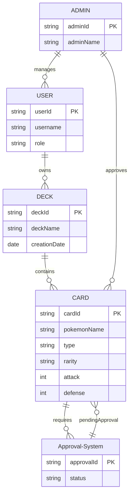
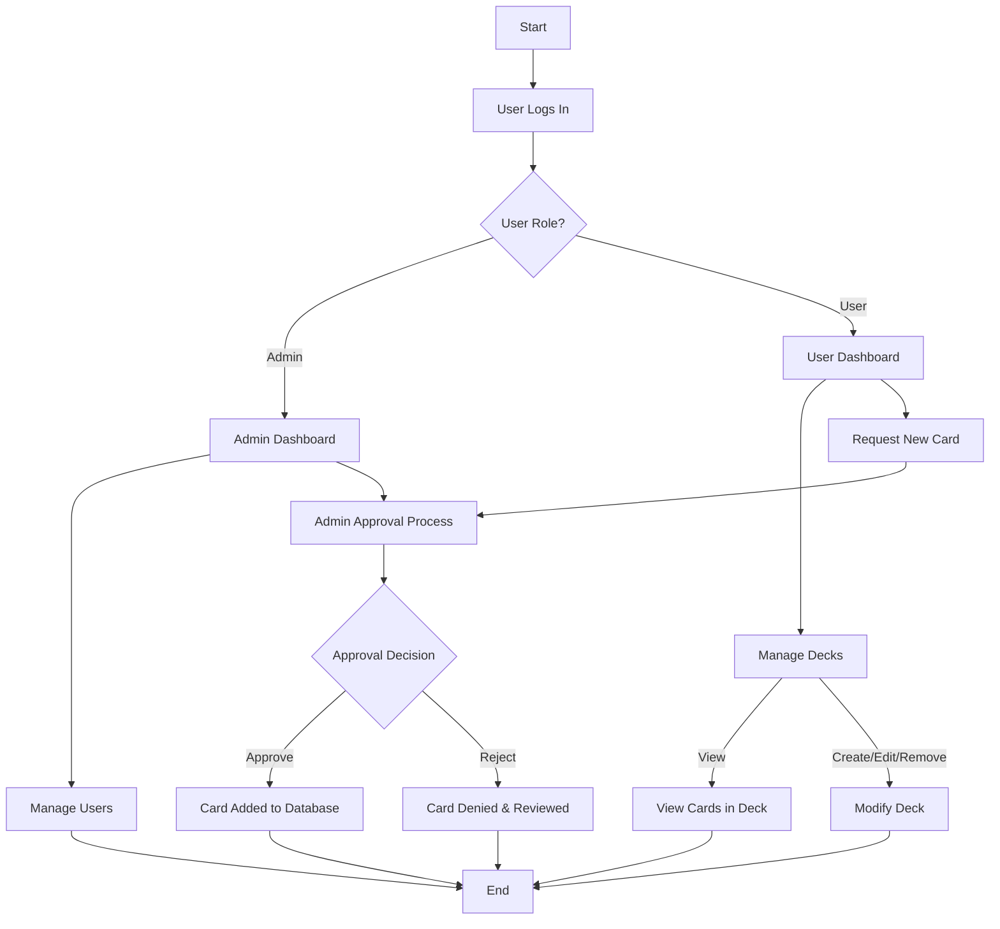

# 
Diagrams

## Entity Relationship Diagram

```mermaid


erDiagram
    USER ||--o{ DECK : owns
    USER {
        string userId PK
        string username
        string role
    }

    DECK ||--o{ CARD : contains
    DECK {
        string deckId PK
        string deckName
        date creationDate
    }

    CARD {
        string cardId PK
        string pokemonName
        string type
        string rarity
        int attack
        int defense
    }

    ADMIN ||--o{ USER : manages
    ADMIN ||--o{ CARD : approves
    ADMIN {
        string adminId PK
        string adminName
    }

    "Approval-System" ||--o{ CARD : pendingApproval
    "Approval-System" {
        string approvalId PK
        string status
    }
    
    CARD ||--o{ "Approval-System" : requires

```

---

## User Flow Diagram

```mermaid
flowchart TD
    %% Start Point
    A[Start] --> B[User Logs In]

    %% Role Decision
    B --> C{User Role?}
    C -->|Admin| D[Admin Dashboard]
    C -->|User| E[User Dashboard]

    %% User Dashboard Actions
    E --> F[Manage Decks]
    F -->|View| F1[View Cards in Deck]
    F -->|Create/Edit/Remove| F2[Modify Deck]
    E --> K[Request New Card]

    %% Admin Actions
    D --> N[Manage Users]
    D --> M[Admin Approval Process]

    %% Card Request linked to Admin Approval
    K --> M

    %% Approval Decision
    M --> M1{Approval Decision}
    M1 -->|Approve| O[Card Added to Database]
    M1 -->|Reject| P[Card Denied & Reviewed]

    %% End Point
    O --> V[End]
    P --> V
    F1 --> V
    F2 --> V
    N --> V
    
```